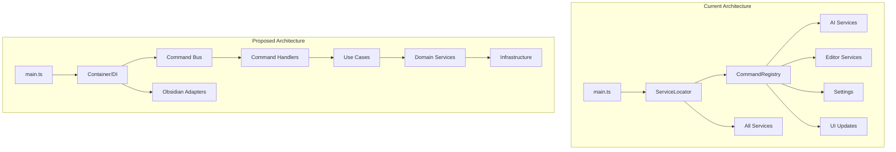
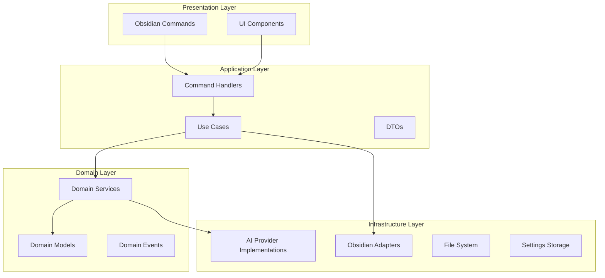

# ChatGPT MD Plugin Architecture & Refactoring Plan

## Table of Contents

- [Executive Summary](#executive-summary)
- [Current Architecture Problems](#current-architecture-problems)
- [Proposed Architecture](#proposed-architecture)
- [Detailed Refactoring Strategy](#detailed-refactoring-strategy)
- [Testing Strategy](#testing-strategy)
- [Implementation Roadmap](#implementation-roadmap)
- [Migration Strategy](#migration-strategy)
- [Success Metrics](#success-metrics)

## Executive Summary

This document outlines a comprehensive refactoring plan for the ChatGPT MD plugin, focusing on improving testability, simplifying command structure, and reorganizing services. The goal is to create a more maintainable, testable, and contributor-friendly codebase while maintaining all existing functionality.

## Current Architecture Problems

### 1. **Testability Blockers**

- Direct Obsidian API dependencies throughout the codebase
- No abstraction layer between business logic and framework
- Eager service initialization in ServiceLocator
- No test infrastructure

### 2. **Command Complexity**

- CommandRegistry handles too many responsibilities
- Business logic mixed with UI concerns
- Long, nested callback methods
- Tight coupling between commands and services

### 3. **Service Organization Issues**

- Unclear service boundaries
- Circular dependencies potential
- Mixed abstraction levels
- Poor type safety with excessive `any` usage

## Proposed Architecture

### High-Level Architecture Comparison



### Layered Architecture



## Detailed Refactoring Strategy

### Phase 1: Establish Testing Infrastructure

#### 1.1 Create Abstraction Layer

```typescript
// src/core/abstractions/IEditor.ts
export interface IEditor {
  getValue(): string;
  setValue(value: string): void;
  getCursor(): IEditorPosition;
  setCursor(pos: IEditorPosition): void;
  replaceRange(text: string, from: IEditorPosition, to?: IEditorPosition): void;
}

// src/core/abstractions/IFileSystem.ts
export interface IFileSystem {
  readFile(path: string): Promise<string>;
  writeFile(path: string, content: string): Promise<void>;
  exists(path: string): Promise<boolean>;
  listFiles(path: string): Promise<string[]>;
}

// src/core/abstractions/INotificationService.ts
export interface INotificationService {
  showInfo(message: string): void;
  showWarning(message: string): void;
  showError(message: string): void;
}

// src/adapters/ObsidianEditor.ts
export class ObsidianEditor implements IEditor {
  constructor(private editor: Editor) {}

  getValue(): string {
    return this.editor.getValue();
  }

  setValue(value: string): void {
    this.editor.setValue(value);
  }

  getCursor(): IEditorPosition {
    const pos = this.editor.getCursor();
    return { line: pos.line, ch: pos.ch };
  }

  setCursor(pos: IEditorPosition): void {
    this.editor.setCursor(pos);
  }

  replaceRange(text: string, from: IEditorPosition, to?: IEditorPosition): void {
    this.editor.replaceRange(text, from, to);
  }
}
```

#### 1.2 Introduce Dependency Injection Container

```typescript
// src/core/Container.ts
export interface ServiceToken<T> {
  name: string;
  type?: T;
}

export class Container {
  private services = new Map<string, any>();
  private factories = new Map<string, () => any>();

  register<T>(token: ServiceToken<T>, factory: () => T): void {
    this.factories.set(token.name, factory);
  }

  resolve<T>(token: ServiceToken<T>): T {
    if (!this.services.has(token.name)) {
      const factory = this.factories.get(token.name);
      if (!factory) throw new Error(`Service ${token.name} not registered`);
      this.services.set(token.name, factory());
    }
    return this.services.get(token.name);
  }

  // Lazy loading support
  registerLazy<T>(token: ServiceToken<T>, factory: () => T): void {
    this.factories.set(token.name, () => {
      const instance = factory();
      this.services.set(token.name, instance);
      return instance;
    });
  }

  // Scoped instances for testing
  createScope(): Container {
    const scopedContainer = new Container();
    scopedContainer.factories = new Map(this.factories);
    return scopedContainer;
  }
}

// Service tokens
export const TOKENS = {
  Editor: { name: "Editor" } as ServiceToken<IEditor>,
  FileSystem: { name: "FileSystem" } as ServiceToken<IFileSystem>,
  NotificationService: { name: "NotificationService" } as ServiceToken<INotificationService>,
  SettingsService: { name: "SettingsService" } as ServiceToken<ISettingsService>,
  AIProviderManager: { name: "AIProviderManager" } as ServiceToken<IAIProviderManager>,
};
```

### Phase 2: Simplify Command Structure

#### 2.1 Command Pattern Implementation

```typescript
// src/commands/interfaces/ICommand.ts
export interface ICommand {
  id: string;
  name: string;
  icon?: string;
  hotkey?: string;
  execute(context: ICommandContext): Promise<void>;
}

export interface ICommandContext {
  editor?: IEditor;
  view?: IView;
  app: IApp;
}

// src/commands/ChatCommand.ts
export class ChatCommand implements ICommand {
  id = "chat-gpt-md:chat";
  name = "Chat";
  icon = "message-circle";
  hotkey = "cmd+j";

  constructor(
    private chatUseCase: ChatUseCase,
    private notificationService: INotificationService
  ) {}

  async execute(context: ICommandContext): Promise<void> {
    if (!context.editor) {
      this.notificationService.showWarning("No active editor");
      return;
    }

    try {
      await this.chatUseCase.startChat({
        editor: context.editor,
        view: context.view,
      });
    } catch (error) {
      this.notificationService.showError(`Chat failed: ${error.message}`);
    }
  }
}

// src/commands/InferTitleCommand.ts
export class InferTitleCommand implements ICommand {
  id = "chat-gpt-md:infer-title";
  name = "Infer Title";
  icon = "subtitles";

  constructor(
    private inferTitleUseCase: InferTitleUseCase,
    private notificationService: INotificationService
  ) {}

  async execute(context: ICommandContext): Promise<void> {
    if (!context.view) {
      this.notificationService.showWarning("No active view");
      return;
    }

    try {
      const newTitle = await this.inferTitleUseCase.inferTitle(context.view);
      this.notificationService.showInfo(`Title updated: ${newTitle}`);
    } catch (error) {
      this.notificationService.showError(`Title inference failed: ${error.message}`);
    }
  }
}
```

#### 2.2 Command Registry Refactoring

```typescript
// src/core/CommandRegistry.ts
export class CommandRegistry {
  private commands = new Map<string, ICommand>();

  constructor(
    private plugin: Plugin,
    private container: Container
  ) {}

  register(command: ICommand): void {
    this.commands.set(command.id, command);

    this.plugin.addCommand({
      id: command.id,
      name: command.name,
      icon: command.icon,
      hotkey: command.hotkey ? { key: command.hotkey } : undefined,
      editorCallback: async (editor: Editor, view: MarkdownView) => {
        const context: ICommandContext = {
          editor: new ObsidianEditor(editor),
          view: new ObsidianView(view),
          app: this.plugin.app,
        };

        await command.execute(context);
      },
    });
  }

  registerAll(): void {
    // Register all commands
    this.register(
      new ChatCommand(this.container.resolve(TOKENS.ChatUseCase), this.container.resolve(TOKENS.NotificationService))
    );

    this.register(
      new InferTitleCommand(
        this.container.resolve(TOKENS.InferTitleUseCase),
        this.container.resolve(TOKENS.NotificationService)
      )
    );

    // ... register other commands
  }
}
```

### Phase 3: Use Case Layer

#### 3.1 Business Logic Extraction

```typescript
// src/usecases/ChatUseCase.ts
export interface IChatContext {
  editor: IEditor;
  view?: IView;
}

export class ChatUseCase {
  constructor(
    private aiProviderManager: IAIProviderManager,
    private editorService: IEditorService,
    private settingsService: ISettingsService,
    private messageParser: IMessageParser,
    private frontmatterService: IFrontmatterService
  ) {}

  async startChat(context: IChatContext): Promise<void> {
    // Get configuration
    const settings = await this.settingsService.getSettings();
    const frontmatter = await this.frontmatterService.extract(context.view);
    const config = this.mergeConfiguration(settings, frontmatter);

    // Parse messages from editor
    const messages = await this.messageParser.parse(context.editor.getValue(), config);

    // Get appropriate AI provider
    const provider = this.aiProviderManager.getProvider(config.aiService);

    // Prepare editor for response
    if (!config.generateAtCursor) {
      this.editorService.moveCursorToEnd(context.editor);
    }

    // Insert assistant header
    await this.editorService.insertAssistantHeader(context.editor, config.model);

    // Make API call
    const response = await provider.chat({
      messages,
      config: config.toProviderConfig(),
      streaming: config.stream ? context.editor : undefined,
    });

    // Process response
    await this.editorService.processResponse(context.editor, response, config);

    // Auto-infer title if enabled
    if (config.autoInferTitle && this.shouldInferTitle(messages)) {
      await this.autoInferTitle(context.view, messages, config);
    }
  }

  private mergeConfiguration(settings: ISettings, frontmatter: IFrontmatter): IChatConfiguration {
    return new ChatConfiguration({
      ...settings.toObject(),
      ...frontmatter.toObject(),
    });
  }

  private shouldInferTitle(messages: Message[]): boolean {
    return messages.length >= MIN_AUTO_INFER_MESSAGES;
  }

  private async autoInferTitle(view: IView, messages: Message[], config: IChatConfiguration): Promise<void> {
    // Delegate to InferTitleUseCase
    // This avoids circular dependencies
  }
}

// src/usecases/InferTitleUseCase.ts
export class InferTitleUseCase {
  constructor(
    private aiProviderManager: IAIProviderManager,
    private fileService: IFileService,
    private messageParser: IMessageParser,
    private settingsService: ISettingsService
  ) {}

  async inferTitle(view: IView): Promise<string> {
    const content = await view.getContent();
    const settings = await this.settingsService.getSettings();
    const messages = await this.messageParser.parse(content, settings);

    if (messages.length < 2) {
      throw new Error("Not enough messages to infer title");
    }

    const provider = this.aiProviderManager.getProvider(settings.aiService);
    const prompt = this.createTitlePrompt(messages, settings.inferTitleLanguage);

    const response = await provider.complete({
      prompt,
      maxTokens: 50,
      temperature: 0.3,
    });

    const title = this.sanitizeTitle(response.text);
    await this.fileService.renameFile(view.path, title);

    return title;
  }

  private createTitlePrompt(messages: Message[], language: string): string {
    return `Infer a concise title from these messages. 
    The title must not contain: : \\ / * ? " < > |
    Language: ${language}
    Messages: ${JSON.stringify(messages)}
    Title:`;
  }

  private sanitizeTitle(title: string): string {
    return title
      .trim()
      .replace(/[:\\/*?"<>|]/g, "")
      .substring(0, 100);
  }
}
```

### Phase 4: Service Reorganization

#### 4.1 Domain Services

```typescript
// src/domain/services/MessageParser.ts
export interface IMessageParser {
  parse(content: string, config: IParseConfig): Message[];
}

export class MessageParser implements IMessageParser {
  parse(content: string, config: IParseConfig): Message[] {
    const lines = content.split("\n");
    const messages: Message[] = [];
    let currentRole: Role | null = null;
    let currentContent: string[] = [];

    for (const line of lines) {
      const roleMatch = this.extractRole(line, config.headingLevel);

      if (roleMatch) {
        if (currentRole && currentContent.length > 0) {
          messages.push({
            role: currentRole,
            content: currentContent.join("\n").trim(),
          });
        }

        currentRole = roleMatch;
        currentContent = [];
      } else if (currentRole) {
        currentContent.push(line);
      }
    }

    // Add last message
    if (currentRole && currentContent.length > 0) {
      messages.push({
        role: currentRole,
        content: currentContent.join("\n").trim(),
      });
    }

    return messages;
  }

  private extractRole(line: string, headingLevel: number): Role | null {
    const pattern = new RegExp(`^${"#".repeat(headingLevel)}\\s+(user|assistant|system)`, "i");
    const match = line.match(pattern);

    if (match) {
      return match[1].toLowerCase() as Role;
    }

    return null;
  }
}

// src/domain/services/ConfigurationMerger.ts
export class ConfigurationMerger {
  merge(base: IConfiguration, override: Partial<IConfiguration>): IConfiguration {
    const merged = { ...base };

    for (const [key, value] of Object.entries(override)) {
      if (value !== undefined && value !== null) {
        merged[key] = value;
      }
    }

    return this.validate(merged);
  }

  private validate(config: IConfiguration): IConfiguration {
    // Validation logic
    if (config.temperature < 0 || config.temperature > 2) {
      throw new Error("Temperature must be between 0 and 2");
    }

    if (config.maxTokens < 1) {
      throw new Error("Max tokens must be positive");
    }

    return config;
  }
}
```

#### 4.2 Infrastructure Services

```typescript
// src/infrastructure/ObsidianFileService.ts
export class ObsidianFileService implements IFileService {
  constructor(private vault: Vault) {}

  async readFile(path: string): Promise<string> {
    const file = this.vault.getAbstractFileByPath(path);
    if (!file || !(file instanceof TFile)) {
      throw new Error(`File not found: ${path}`);
    }
    return await this.vault.read(file);
  }

  async writeFile(path: string, content: string): Promise<void> {
    const file = this.vault.getAbstractFileByPath(path);
    if (file instanceof TFile) {
      await this.vault.modify(file, content);
    } else {
      await this.vault.create(path, content);
    }
  }

  async renameFile(oldPath: string, newName: string): Promise<void> {
    const file = this.vault.getAbstractFileByPath(oldPath);
    if (!file) {
      throw new Error(`File not found: ${oldPath}`);
    }

    const dir = oldPath.substring(0, oldPath.lastIndexOf("/"));
    const newPath = `${dir}/${newName}.md`;

    await this.vault.rename(file, newPath);
  }
}

// src/infrastructure/providers/OpenAIProvider.ts
export class OpenAIProvider implements IAIProvider {
  constructor(
    private apiKey: string,
    private httpClient: IHttpClient
  ) {}

  async chat(request: IChatRequest): Promise<IChatResponse> {
    const response = await this.httpClient.post({
      url: "https://api.openai.com/v1/chat/completions",
      headers: {
        Authorization: `Bearer ${this.apiKey}`,
        "Content-Type": "application/json",
      },
      body: {
        model: request.config.model,
        messages: request.messages,
        temperature: request.config.temperature,
        max_tokens: request.config.maxTokens,
        stream: request.streaming !== undefined,
      },
    });

    if (request.streaming) {
      return this.handleStreamingResponse(response, request.streaming);
    }

    return {
      content: response.choices[0].message.content,
      model: response.model,
      usage: response.usage,
    };
  }

  private async handleStreamingResponse(response: IHttpResponse, editor: IEditor): Promise<IChatResponse> {
    // Streaming implementation
  }
}
```

### Phase 5: Type Safety Improvements

#### 5.1 Configuration Types

```typescript
// src/config/types.ts
export interface ChatConfig {
  model: string;
  temperature: number;
  maxTokens: number;
  systemCommands: string[];
  stream: boolean;
  provider: AIProvider;
  presencePenalty: number;
  frequencyPenalty: number;
  topP: number;
  generateAtCursor: boolean;
  autoInferTitle: boolean;
  inferTitleLanguage: string;
  headingLevel: HeadingLevel;
}

export enum AIProvider {
  OpenAI = "openai",
  Anthropic = "anthropic",
  Ollama = "ollama",
  OpenRouter = "openrouter",
  LMStudio = "lmstudio",
}

export enum HeadingLevel {
  H1 = 1,
  H2 = 2,
  H3 = 3,
  H4 = 4,
  H5 = 5,
  H6 = 6,
}

export type Role = "user" | "assistant" | "system";

export interface Message {
  role: Role;
  content: string;
}

// src/config/ConfigValidator.ts
export class ConfigValidator {
  validate(config: unknown): Result<ChatConfig, ValidationError> {
    if (!isObject(config)) {
      return Result.fail(new ValidationError("Config must be an object"));
    }

    const errors: string[] = [];

    // Validate required fields
    if (!isString(config.model)) {
      errors.push("model must be a string");
    }

    // Validate numeric ranges
    if (!isNumber(config.temperature) || config.temperature < 0 || config.temperature > 2) {
      errors.push("temperature must be between 0 and 2");
    }

    if (!isNumber(config.maxTokens) || config.maxTokens < 1) {
      errors.push("maxTokens must be positive");
    }

    // Validate enums
    if (!Object.values(AIProvider).includes(config.provider)) {
      errors.push(`provider must be one of: ${Object.values(AIProvider).join(", ")}`);
    }

    if (errors.length > 0) {
      return Result.fail(new ValidationError(errors.join("; ")));
    }

    return Result.ok(config as ChatConfig);
  }
}

// src/config/Result.ts
export class Result<T, E> {
  private constructor(
    private readonly value?: T,
    private readonly error?: E
  ) {}

  static ok<T, E>(value: T): Result<T, E> {
    return new Result<T, E>(value, undefined);
  }

  static fail<T, E>(error: E): Result<T, E> {
    return new Result<T, E>(undefined, error);
  }

  isOk(): boolean {
    return this.error === undefined;
  }

  isFail(): boolean {
    return !this.isOk();
  }

  unwrap(): T {
    if (this.isOk()) {
      return this.value!;
    }
    throw new Error("Cannot unwrap failed result");
  }

  unwrapError(): E {
    if (this.isFail()) {
      return this.error!;
    }
    throw new Error("Cannot unwrap error from successful result");
  }

  map<U>(fn: (value: T) => U): Result<U, E> {
    if (this.isOk()) {
      return Result.ok(fn(this.value!));
    }
    return Result.fail(this.error!);
  }

  mapError<F>(fn: (error: E) => F): Result<T, F> {
    if (this.isFail()) {
      return Result.fail(fn(this.error!));
    }
    return Result.ok(this.value!);
  }
}
```

## Testing Strategy

### Unit Test Examples

```typescript
// tests/unit/domain/MessageParser.test.ts
import { MessageParser } from "@/domain/services/MessageParser";

describe("MessageParser", () => {
  let parser: MessageParser;

  beforeEach(() => {
    parser = new MessageParser();
  });

  describe("parse", () => {
    it("should parse user and assistant messages", () => {
      const content = `## user
Hello, how are you?

## assistant
I'm doing well, thank you!`;

      const messages = parser.parse(content, { headingLevel: 2 });

      expect(messages).toHaveLength(2);
      expect(messages[0]).toEqual({
        role: "user",
        content: "Hello, how are you?",
      });
      expect(messages[1]).toEqual({
        role: "assistant",
        content: "I'm doing well, thank you!",
      });
    });

    it("should handle system messages", () => {
      const content = `## system
You are a helpful assistant.

## user
What is 2+2?`;

      const messages = parser.parse(content, { headingLevel: 2 });

      expect(messages).toHaveLength(2);
      expect(messages[0].role).toBe("system");
      expect(messages[1].role).toBe("user");
    });

    it("should ignore content before first role heading", () => {
      const content = `Some notes here
      
## user
First message`;

      const messages = parser.parse(content, { headingLevel: 2 });

      expect(messages).toHaveLength(1);
      expect(messages[0].content).toBe("First message");
    });

    it("should handle different heading levels", () => {
      const content = `### user
Message with H3`;

      const messages = parser.parse(content, { headingLevel: 3 });

      expect(messages).toHaveLength(1);
      expect(messages[0].role).toBe("user");
    });
  });
});

// tests/unit/usecases/ChatUseCase.test.ts
import { ChatUseCase } from "@/usecases/ChatUseCase";
import { createMockContainer } from "../helpers/mockContainer";

describe("ChatUseCase", () => {
  let useCase: ChatUseCase;
  let mockContainer: MockContainer;

  beforeEach(() => {
    mockContainer = createMockContainer();
    useCase = new ChatUseCase(
      mockContainer.aiProviderManager,
      mockContainer.editorService,
      mockContainer.settingsService,
      mockContainer.messageParser,
      mockContainer.frontmatterService
    );
  });

  describe("startChat", () => {
    it("should complete chat flow successfully", async () => {
      // Arrange
      const context = {
        editor: mockContainer.createEditor("## user\nHello"),
        view: mockContainer.createView(),
      };

      mockContainer.settingsService.mockSettings({
        aiService: "openai",
        model: "gpt-4",
        stream: false,
      });

      mockContainer.aiProviderManager.mockResponse({
        content: "Hello! How can I help you?",
        model: "gpt-4",
      });

      // Act
      await useCase.startChat(context);

      // Assert
      expect(mockContainer.editorService.insertAssistantHeader).toHaveBeenCalledWith(context.editor, "gpt-4");

      expect(mockContainer.aiProviderManager.getProvider).toHaveBeenCalledWith("openai");

      const editorContent = context.editor.getValue();
      expect(editorContent).toContain("## assistant");
      expect(editorContent).toContain("Hello! How can I help you?");
    });

    it("should handle streaming responses", async () => {
      // Arrange
      const context = {
        editor: mockContainer.createEditor("## user\nTest"),
        view: mockContainer.createView(),
      };

      mockContainer.settingsService.mockSettings({
        aiService: "openai",
        stream: true,
      });

      const streamingResponse = mockContainer.createStreamingResponse(["Hello", ", how ", "are you?"]);

      mockContainer.aiProviderManager.mockResponse(streamingResponse);

      // Act
      await useCase.startChat(context);

      // Assert
      expect(context.editor.getValue()).toContain("Hello, how are you?");
    });

    it("should auto-infer title when enabled", async () => {
      // Test auto title inference
    });
  });
});
```

### Integration Test Examples

```typescript
// tests/integration/ChatFlow.test.ts
import { createTestPlugin } from "../helpers/testPlugin";
import { waitFor } from "../helpers/async";

describe("Chat Flow Integration", () => {
  let testPlugin: TestPlugin;

  beforeEach(async () => {
    testPlugin = await createTestPlugin();
  });

  afterEach(async () => {
    await testPlugin.cleanup();
  });

  it("should complete full chat flow", async () => {
    // Create a test note
    const note = await testPlugin.createNote(
      "test-chat.md",
      `
---
model: gpt-4
temperature: 0.7
---

## user
What is the capital of France?
`
    );

    // Execute chat command
    await testPlugin.executeCommand("chat-gpt-md:chat");

    // Wait for response
    await waitFor(() => {
      const content = note.getContent();
      return content.includes("## assistant");
    });

    // Verify response
    const content = note.getContent();
    expect(content).toContain("Paris");
    expect(content).toContain("[gpt-4]");
  });

  it("should handle model switching", async () => {
    const note = await testPlugin.createNote("multi-model.md", "");

    // First chat with GPT-4
    await note.setFrontmatter({ model: "gpt-4" });
    await note.appendContent("## user\nHello");
    await testPlugin.executeCommand("chat-gpt-md:chat");

    await waitFor(() => note.getContent().includes("## assistant"));

    // Switch to Claude
    await note.setFrontmatter({ model: "anthropic@claude-3-sonnet" });
    await note.appendContent("\n## user\nAnother question");
    await testPlugin.executeCommand("chat-gpt-md:chat");

    await waitFor(() => {
      const content = note.getContent();
      return content.includes("[claude-3-sonnet]");
    });

    // Verify both models were used
    const content = note.getContent();
    expect(content).toContain("[gpt-4]");
    expect(content).toContain("[claude-3-sonnet]");
  });
});
```

### Test Utilities

```typescript
// tests/helpers/mockContainer.ts
export function createMockContainer(): MockContainer {
  const mocks = {
    aiProviderManager: createMockAIProviderManager(),
    editorService: createMockEditorService(),
    settingsService: createMockSettingsService(),
    messageParser: new MessageParser(), // Use real implementation
    frontmatterService: createMockFrontmatterService(),
    notificationService: createMockNotificationService(),
  };

  return {
    ...mocks,
    createEditor: (content: string) => new MockEditor(content),
    createView: () => new MockView(),
    createStreamingResponse: (chunks: string[]) => new MockStreamingResponse(chunks),
  };
}

// tests/helpers/MockEditor.ts
export class MockEditor implements IEditor {
  private content: string;
  private cursor: IEditorPosition = { line: 0, ch: 0 };

  constructor(initialContent: string) {
    this.content = initialContent;
  }

  getValue(): string {
    return this.content;
  }

  setValue(value: string): void {
    this.content = value;
  }

  getCursor(): IEditorPosition {
    return { ...this.cursor };
  }

  setCursor(pos: IEditorPosition): void {
    this.cursor = { ...pos };
  }

  replaceRange(text: string, from: IEditorPosition, to?: IEditorPosition): void {
    // Simplified implementation for testing
    this.content += "\n" + text;
  }
}
```

## Implementation Roadmap

### Week 1-2: Foundation

- [ ] Set up testing infrastructure
  - [ ] Install Jest and testing utilities
  - [ ] Configure TypeScript for tests
  - [ ] Create test helpers and mocks
- [ ] Create abstraction interfaces
  - [ ] IEditor, IFileSystem, INotificationService
  - [ ] IView, IApp, IVault
- [ ] Implement basic dependency injection container
  - [ ] Container with registration and resolution
  - [ ] Service tokens for type safety
  - [ ] Scoped containers for testing
- [ ] Add first unit tests
  - [ ] Test pure functions (MessageParser, ConfigValidator)
  - [ ] Test domain services
  - [ ] Achieve 50% coverage for new code

### Week 3-4: Command Refactoring

- [ ] Extract commands into separate classes
  - [ ] ChatCommand
  - [ ] InferTitleCommand
  - [ ] SelectModelCommand
  - [ ] Utility commands (Clear, AddDivider, etc.)
- [ ] Implement command bus pattern
  - [ ] CommandBus with registration
  - [ ] Async command execution
  - [ ] Error handling
- [ ] Create use case layer
  - [ ] ChatUseCase
  - [ ] InferTitleUseCase
  - [ ] ModelSelectionUseCase
- [ ] Migrate existing commands
  - [ ] One command at a time
  - [ ] Maintain backward compatibility
  - [ ] Add tests for each migrated command

### Week 5-6: Service Reorganization

- [ ] Separate domain from infrastructure
  - [ ] Extract pure domain services
  - [ ] Create infrastructure adapters
  - [ ] Define clear interfaces
- [ ] Implement service interfaces
  - [ ] IAIProvider with implementations
  - [ ] IFileService, IEditorService
  - [ ] ISettingsService with validation
- [ ] Add type safety
  - [ ] Replace `any` with proper types
  - [ ] Add configuration types
  - [ ] Implement Result type for error handling
- [ ] Create service factories
  - [ ] AIProviderFactory
  - [ ] Dynamic service registration

### Week 7-8: Testing & Documentation

- [ ] Achieve test coverage goals
  - [ ] 80% coverage for business logic
  - [ ] 60% coverage for infrastructure
  - [ ] 100% coverage for critical paths
- [ ] Add integration tests
  - [ ] Full chat flow
  - [ ] Model switching
  - [ ] Error scenarios
- [ ] Update documentation
  - [ ] Architecture diagrams
  - [ ] Contribution guidelines
  - [ ] API documentation
- [ ] Create ADRs
  - [ ] Testing strategy
  - [ ] Dependency injection choice
  - [ ] Command pattern implementation

## Migration Strategy

### 1. Parallel Development

- Keep existing code functional during refactoring
- Create new structure alongside old
- Gradually move functionality

### 2. Feature Flags

```typescript
// src/config/FeatureFlags.ts
export class FeatureFlags {
  static readonly USE_NEW_COMMAND_SYSTEM = process.env.NEW_COMMANDS === 'true';
  static readonly USE_NEW_DI_CONTAINER = process.env.NEW_DI === 'true';
}

// Usage in main.ts
async onload() {
  if (FeatureFlags.USE_NEW_DI_CONTAINER) {
    await this.loadWithNewContainer();
  } else {
    await this.loadLegacy();
  }
}
```

### 3. Incremental Migration

1. Start with leaf services (no dependencies)
2. Move to domain services
3. Refactor commands one by one
4. Finally, update main entry point

### 4. Backward Compatibility

- All existing configurations must work
- Frontmatter format unchanged
- Command IDs remain the same
- Settings migration for any changes

## Success Metrics

### Code Quality

- **Test Coverage**: >80% for business logic
- **Cyclomatic Complexity**: <10 per method
- **Method Length**: <50 lines
- **Class Size**: <300 lines
- **Type Coverage**: 100% strict TypeScript

### Performance

- **Plugin Load Time**: <100ms
- **Command Execution**: <50ms overhead
- **Test Suite**: <30 seconds
- **Memory Usage**: No increase from current

### Developer Experience

- **Onboarding Time**: <30 minutes to understand architecture
- **First Contribution**: <2 hours for simple features
- **Build Time**: <10 seconds
- **Hot Reload**: Supported for development

### Maintainability

- **Dependency Graph**: Clear, acyclic
- **Documentation**: 100% public API documented
- **Code Reviews**: <30 minutes average
- **Bug Fix Time**: 50% reduction

## Architectural Principles

### 1. Dependency Inversion

- Depend on abstractions, not concretions
- Framework-specific code only in adapters
- Business logic has no framework dependencies

### 2. Single Responsibility

- Each class has one reason to change
- Commands only coordinate, don't implement
- Services focused on specific domains

### 3. Open/Closed Principle

- Easy to add new AI providers
- New commands without modifying registry
- Extensible through interfaces

### 4. Interface Segregation

- Small, focused interfaces
- No god interfaces
- Optional capabilities through composition

### 5. Testability First

- Every class designed for testing
- Dependencies injected
- Side effects isolated

## Next Steps

1. **Review and Approve**: Share this plan with contributors
2. **Create Issues**: Break down into GitHub issues
3. **Set Up CI/CD**: Testing and linting pipeline
4. **Start Foundation**: Begin with testing infrastructure
5. **Regular Reviews**: Weekly progress checks

This architecture plan provides a clear path to transform the ChatGPT MD plugin into a more maintainable, testable, and contributor-friendly codebase while preserving all existing functionality.
