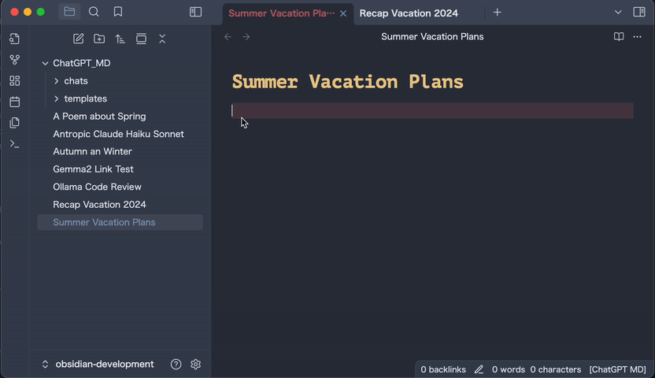

# ChatGPT MD

🚀 A seamless integration of chatGPT, OpenRouter.ai and local LLMs via Ollama into Obsidian.



## What's New in v2.1.0 🚀
- We've added support for **OpenRouter.ai** as an LLM provider in our Obsidian plugin.
Set an OpenRouter.ai API key in the settings, and you can access a wide range of models like 
**Gemini, DeepSeek, Llama, Perplexity** and many more (full list: https://openrouter.ai/models).
- The new command `ChatGPT MD: Select Model` allows you to select from all available LLMs (openAI, Ollama, OpenRouter.ai) 
and set the current model for your note.

## A simple and quick Start 🏁
Get started in just a few simple steps:

1. **Install ChatGPT MD**: Go to `Settings > Community Plugins > Browse`, search for `ChatGPT MD` and click `Install`.
2. **Add your OpenAI API key**: In the plugin settings, add your OpenAI API key and/or install Ollama and local LLMs of your choice.
3. **Start chatting**: Use the `ChatGPT MD: Chat` command (`cmd + p` or `ctrl + p`) to start a conversation from any note.

💡 *Pro tip*: Set up a hotkey for the best experience! Go to `Settings > Hotkeys`, search for `ChatGPT MD: Chat` and add your preferred keybinding (e.g., `cmd + j`).

Start chatting, don't worry too much about the more advanced features. They will come naturally :-) 

## Features
* **Interactive conversations**: 
  * Engage directly with ChatGPT and Ollama from any Markdown note, edit questions or responses on-the-fly, and continue the chat seamlessly.
* **Privacy & Zero API Costs:** 
  * Use local LLMs via Ollama, keeping your chats on your computer and avoiding API costs.
* **System Commands:** 
  * Instruct the LLM via system commands to get the best possible answers.
* **Link context**: 
  * Provide links to any other note in your vault for added context during conversations with Markdown or Wiki links.
* **Per-note Configuration:** 
  * Overwrite default settings via frontmatter for individual notes using params from [OpenAI API](https://platform.openai.com/docs/api-reference/chat) or [Ollama API](https://github.com/ollama/ollama/blob/main/docs/api.md#generate-a-chat-completion).
* **Markdown Support:** 
  * Enjoy full rendering of lists, code blocks, and more from all responses.
* **Minimal Setup:** 
  * Utilize your OpenAI API key or install any LLM locally via Ollama.
* **Comment Blocks:** 
  * Ignore parts of your notes using comment blocks.
* **Chat Templates**: 
  * Use and share frontmatter templates for recurring scenarios. Explore [chatgpt-md-templates](https://github.com/bramses/chatgpt-md-templates).

## Privacy and Security

ChatGPT MD is 
- only storing data locally in your vault, with zero tracking and no 3rd party integrations except direct calls to the openAI API. 
- allowing you to use Ollama, a local LLM installation for offline conversation-based knowledge exploration.

### Default Configuration
The plugin comes with a well-balanced pre-configuration to get you started immediately. 
You can change the global settings or use the local parameters in any note via frontmatter
(start typing `---` in the first line of your note to add properties)
```
---
system_commands: ['I am a helpful assistant.']
temperature: 0.3
top_p: 1
max_tokens: 300
presence_penalty: 0.5
frequency_penalty: 0.5
stream: true
stop: null
n: 1
model: gpt-4o-mini
---
```
💡 Pro tip: Increasing `max_tokens` to a higher value e.g. `4096` for more complex tasks like reasoning, coding or text creation.
The default model `gpt-4o-mini` is a good compromise between fast and cheap responses. Change this if you have more complex needs.

### Multi Model Chats
You can set and change the model for each request in your note. 
Specify the `model` property via frontmatter:

for openAI models
```
---
model: gpt-4o
system_commands: [act as a senior javascript developer]
---
```
prefix it with `local@` for Ollama for local LLMs.
```
---
model: local@gemma2:27b
temperature: 1
---
```


The AI responses will keep the used model name in the response title for future reference.
You can find the list of your installed Ollama model names from your terminal via `ollama list` or the available openAI model names online on this [openAI models](https://platform.openai.com/docs/models) page.

The default url for Ollama is
```
url: http://localhost:11434
```
This can be changed via local frontmatter properties.

### Commands 👨‍💻
Run commands from Obsidian's command pallet via `cmd + p` or `ctrl + p` and start typing `chatgpt` or set hotkeys
(a chat command hotkey is highly recommended for effortless chats (I use `cmd + j`, which works fantastic, because your index finger is already resting on that key)).

#### Main Command
- **Chat**: Parse the file and interact with ChatGPT. Assign a hotkey, e.g. `cmd + j`.
  
#### Creation Commands
- **New Chat with Highlighted Text**: Start a chat using highlighted text and default frontmatter in `Chat Folder`.
- **New Chat From Template**: Create chats from templates in `Chat Template Folder`.

#### Utility Commands
- **Infer Title**: Automatically generate a note title based on the notes content. Configurable to auto-run after 4+ messages.
- **Add Comment Block**: Insert comment blocks for parts of yor note that should be ignored.

#### Maintenance Commands
- **Clear Chat**: Remove all messages while retaining frontmatter.
- **Stop Streaming (Desktop Only)**: Halt ongoing streams if necessary.

#### Formatting Tools
- **Add Divider**: Insert horizontal rulers to organize content visually.

## FAQs ❓
#### How do I start chatting with ChatGPT MD?
Use the `ChatGPT MD: Chat` command from the Obsidian command Palette (`cmd + p` or `ctrl + p`) to start a conversation from any note.

#### Can I set up a hotkey for the `ChatGPT MD: Chat` command?
Yes, you should! Go to `Settings > Hotkeys`, search for `ChatGPT MD: Chat` and add your preferred keybinding (e.g., `cmd + j`).

#### How do I use chat and reasoning models?
You can use openAI's GPT 3 and 4 models and any model you have installed via Ollama.
Compatibility with openAI's o1 and o3 models is on the roadmap.
DeepSeek-r1:7b works great for reasoning locally via Ollama.

#### How do I use a custom endpoint?
Ensure your custom API adheres to OpenAI's specifications, such as Azure's hosted endpoints. Consult your provider for API key management details.

#### Where should I add my OpenAI API key?
In the plugin settings, add your OpenAI API key and/or install Ollama and local LLMs of your choice.

🤖 Enjoy exploring the power of ChatGPT MD in your Obsidian vault!🚀

## Contributions Welcome 🤝
Pull requests, bug reports, and all other forms of contribution are welcomed and highly encouraged!* :octocat:

## About the Developers ✍️
Bram created ChatGPT MD in March 2023 lives in NYC and is building [Your Commonbase](https://bramses.notion.site/Your-Commonbase-ALPHA-10b034182ddd8038b9ffe11cc2833713) (A Self Organizing Scrapbook with Zero Stress Storing, Searching, and Sharing). His personal website and newsletter is located at [bramadams.dev](https://www.bramadams.dev/)

Deniz joined Bram in 2024 to continue development. He is working in a gaming company in Germany and uses AI heavily in his work and private life. Say "hi" on Bluesky: [Deniz](https://bsky.app/profile/denizokcu.bsky.social)

Happy writing with ChatGPT MD! 💻 🎉
