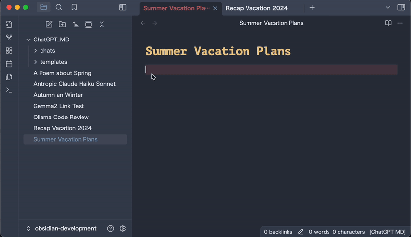

# ChatGPT MD

A seamless integration of openAIs GPT models and Ollama into Obsidian.



## A simple and quick Start:
ChatGPT MD is a Community Plugin
1. Install from: `Settings > Community Plugins > Browse` `ChatGPT MD`
2. add your openAI API key in the `ChatGPT MD Settings` and / or install Ollama and local LLMs of your choice
Chat from any note via `cmd + p` or `ctrl + p` and the `ChatGPT MD: Chat` command

Recommended: add a hotkey from `Settings > Hotkeys` to `ChatGPT MD: Chat` e.g. `cmd + j`


## Advanced Features (which you can ignore if you are new)
- **Chat from Any Note**: Engage with ChatGPT and Ollama directly from your Markdown notes. You can always edit any question or response before continuing the chat.
- **Privacy and Zero API Costs**: Use local LLMs via Ollama and your chats will stay on your computer and cost you nothing.
- **Markdown Support**: Full rendering of lists, code blocks, and more from all responses.
- **Minimal Setup**: Use your openAI API key or install any LLM locally via Ollama.
- **Global and Local Settings**: You can change/use all the settings exposed by the [OpenAI API](https://platform.openai.com/docs/api-reference/chat) or [Ollama API](https://github.com/ollama/ollama/blob/main/docs/api.md#generate-a-chat-completion)
- **System Commands**: Add system commands globally and/or in every note to instruct the LLM how to assist.
- **Link any note**: Provide context to your chats with links to any other note in your vault.
- **Comment Blocks**: Insert comment blocks for parts of your notes that should be ignored.
- **Per note Configuration**: Overwrite the default settings in any note via frontmatter.
- **Highlighted Text Chats**: Initiate chats from selected text.
- **Automatic Title Inference**: Auto-generate titles after 4+ messages.
- **Multilingual Title Inference**: Choose from nine languages for title inference.
- **Custom Endpoints**: Specify custom API endpoints via frontmatter.
- **Customizable Stream Positioning**: Choose to stream at cursor or file end.
- **Chat Templates**: Use and share frontmatter templates for recurring scenarios. Explore [chatgpt-md-templates](https://github.com/bramses/chatgpt-md-templates).

### Default Configuration
You can change the settings or use the same parameters in any note as frontmatter
(start typing `---` in the first line of your note to add properties)
```
---
system_commands: ['I am a helpful assistant.']
temperature: 0.3
top_p: 1
max_tokens: 300
presence_penalty: 0.5
frequency_penalty: 0.5
stream: true
stop: null
n: 1
model: gpt-4o-mini
---
```
Increasing `max_tokens` to a higher value e.g. `4096` for more complex tasks like reasoning, coding or text creation.
The default model `gpt-4o-mini` is a good compromise between fast and cheap responses. Change this if you have more complex needs.

### Multi Model Chats
You can set and change the model for each request in your note. 
Specify the `model` property via frontmatter:

for openAI models
```
---
model: gpt-4o
system_commands: [act as a senior javascript developer]
---
```
prefix it with `local@` for Ollama
```
---
model: local@gemma2:27b
temperature: 1
---
```
for local LLMs.

The AI responses will keep the used model name in the response title for future reference.
You can find the list of your installed Ollama model names from your terminal via `ollama list` or the available openAI model names online on this [openAI models](https://platform.openai.com/docs/models) page.

The default url for Ollama is
```
url: http://localhost:11434
```
This can be changed via local frontmatter properties.

### Commands
Run commands from Obsidian's command pallet via `cmd + p` or `ctrl + p` and start typing `chatgpt` or set hotkeys
(a chat command hotkey is highly recommended for effortless chats (I use `cmd + j`, which works fantastic, because your index finger is already resting on that key)).

#### Main Command
- **Chat**: Parse the file and interact with ChatGPT. Assign a hotkey, e.g. `cmd + j`.
  
#### Creation Commands
- **New Chat with Highlighted Text**: Start a chat using highlighted text and default frontmatter in `Chat Folder`.
- **New Chat From Template**: Create chats from templates in `Chat Template Folder`.

#### Utility Commands
- **Infer Title**: Automatically generate a note title based on the notes content. Configurable to auto-run after 4+ messages.
- **Add Comment Block**: Insert comment blocks for parts of yor note that should be ignored.

#### Maintenance Commands
- **Clear Chat**: Remove all messages while retaining frontmatter.
- **Stop Streaming (Desktop Only)**: Halt ongoing streams if necessary.

#### Formatting Tools
- **Add Divider**: Insert horizontal rulers to organize content visually.

## FAQs
#### How do I use chat and reasoning models?
You can use openAI's GPT 3 and 4 models and any model you have installed via Ollama.
Compatibility with openAI's o1 and o3 models is on the roadmap.
DeepSeek-r1:7b works great locally via Ollama.

#### How do I use a custom endpoint?
Ensure your custom API adheres to OpenAI's specifications, such as Azure's hosted endpoints. Consult your provider for API key management details.

## Contributions are welcome
Pull requests, bug reports, and all other forms of contribution are welcomed and highly encouraged!* :octocat:

## About the Developer
Bram Adams is a NYC-based writer and programmer, known for his work integrating AI into creative tools like Obsidian. He actively develops projects like [Commonplace Bot](https://github.com/bramses/commonplace-bot) and [Stenography](https://stenography.dev), which enhance productivity through LLMs and automated documentation. Bram has contributed significantly to the developer community through educational courses and innovative software solutions. Learn more about his work on his [website](https://www.bramadams.dev/about/).

Support Bram by subscribing to his newsletter [here](https://www.bramadams.dev/#/portal/).
