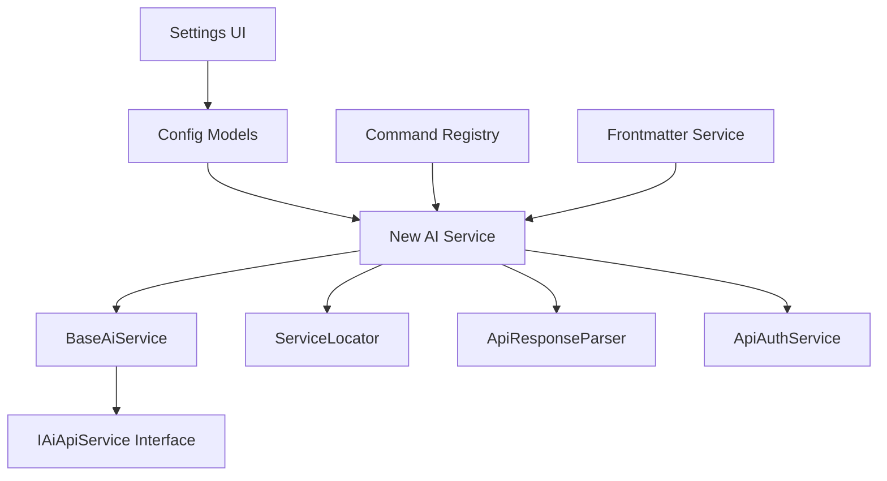

# Adding New AI Services to ChatGPT MD

This guide explains how to add a new AI service to the ChatGPT MD plugin, following the established architectural patterns. The plugin uses a consistent service architecture that makes adding new AI providers straightforward.

## Overview

The ChatGPT MD plugin uses a service-oriented architecture where each AI provider is implemented as a separate service that extends the `BaseAiService` class. All services follow the same patterns for:

- Authentication
- Request/response handling
- Streaming and non-streaming APIs
- Error handling
- Configuration management
- UI integration

## Architecture Pattern



## Step-by-Step Implementation

### 1. Define Service Constants

**File:** [`src/Constants.ts`](../src/Constants.ts)

```typescript
// Add your service constant
export const AI_SERVICE_YOURSERVICE = "yourservice";

// Add API endpoint (placeholder - will be customized in service)
export const API_ENDPOINTS = {
  // ... existing services
  [AI_SERVICE_YOURSERVICE]: "/api/endpoint",
};
```

### 2. Create Service Implementation

**File:** `src/Services/YourService.ts`

Create a new service file following this template:

```typescript
import { Editor } from "obsidian";
import { Message } from "src/Models/Message";
import { AI_SERVICE_YOURSERVICE, ROLE_SYSTEM } from "src/Constants";
import { BaseAiService, IAiApiService } from "./AiService";
import { ChatGPT_MDSettings } from "src/Models/Config";
import { ApiService } from "./ApiService";
import { ApiAuthService, isValidApiKey } from "./ApiAuthService";
import { ApiResponseParser } from "./ApiResponseParser";
import { ErrorService } from "./ErrorService";
import { NotificationService } from "./NotificationService";

export const DEFAULT_YOURSERVICE_CONFIG: YourServiceConfig = {
  aiService: AI_SERVICE_YOURSERVICE,
  max_tokens: 1024,
  model: "yourservice@default-model",
  stream: true,
  system_commands: null,
  tags: [],
  temperature: 0.7,
  title: "Untitled",
  url: "https://api.yourservice.com",
  // Add service-specific parameters
};

export const fetchAvailableYourServiceModels = async (url: string, apiKey: string) => {
  // Implement model fetching logic
  // Return array of models with "yourservice@" prefix
};

export class YourService extends BaseAiService implements IAiApiService {
  protected serviceType = AI_SERVICE_YOURSERVICE;

  constructor(
    errorService?: ErrorService,
    notificationService?: NotificationService,
    apiService?: ApiService,
    apiAuthService?: ApiAuthService,
    apiResponseParser?: ApiResponseParser
  ) {
    super(errorService, notificationService);
    // Initialize dependencies
  }

  getDefaultConfig(): YourServiceConfig {
    return DEFAULT_YOURSERVICE_CONFIG;
  }

  getApiKeyFromSettings(settings: ChatGPT_MDSettings): string {
    return this.apiAuthService.getApiKey(settings, AI_SERVICE_YOURSERVICE);
  }

  protected getSystemMessageRole(): string {
    return ROLE_SYSTEM; // or service-specific role
  }

  protected supportsSystemField(): boolean {
    return true; // or false, depending on API
  }

  createPayload(config: YourServiceConfig, messages: Message[]): YourServicePayload {
    // Convert messages to service-specific format
    // Return properly formatted payload
  }

  handleAPIError(err: any, config: YourServiceConfig, prefix: string): never {
    // Implement service-specific error handling
  }

  protected async callStreamingAPI(/* ... */): Promise<StreamingResponse> {
    // Implement streaming API calls
  }

  protected async callNonStreamingAPI(/* ... */): Promise<any> {
    // Implement non-streaming API calls
  }

  // Override methods as needed for service-specific behavior
}

// Define interfaces
export interface YourServicePayload {
  // Service-specific payload structure
}

export interface YourServiceConfig {
  // Service-specific configuration
}
```

### 3. Update Configuration Models

**File:** [`src/Models/Config.ts`](../src/Models/Config.ts)

```typescript
// Add import
import { DEFAULT_YOURSERVICE_CONFIG } from "src/Services/YourService";

// Add API key to ApiKeySettings
export interface ApiKeySettings {
  // ... existing keys
  yourserviceApiKey: string;
}

// Add URL to ServiceUrlSettings
export interface ServiceUrlSettings {
  // ... existing URLs
  yourserviceUrl: string;
}

// Add to DEFAULT_SETTINGS
export const DEFAULT_SETTINGS: ChatGPT_MDSettings = {
  // API Keys
  yourserviceApiKey: "",

  // Service URLs
  yourserviceUrl: DEFAULT_YOURSERVICE_CONFIG.url,

  // ... rest of settings
};
```

### 4. Update Authentication Service

**File:** [`src/Services/ApiAuthService.ts`](../src/Services/ApiAuthService.ts)

```typescript
// Add import
import { AI_SERVICE_YOURSERVICE } from "src/Constants";

// Add to getApiKey method
getApiKey(settings: ChatGPT_MDSettings, serviceType: string): string {
  switch (serviceType) {
    // ... existing cases
    case AI_SERVICE_YOURSERVICE:
      return settings.yourserviceApiKey;
    default:
      return "";
  }
}

// Add to createAuthHeaders method
createAuthHeaders(apiKey: string, serviceType: string): Record<string, string> {
  // ... existing code

  switch (serviceType) {
    // ... existing cases
    case AI_SERVICE_YOURSERVICE:
      headers["Authorization"] = `Bearer ${apiKey}`;
      // or whatever auth format your service uses
      break;
  }

  return headers;
}
```

### 5. Update Response Parser

**File:** [`src/Services/ApiResponseParser.ts`](../src/Services/ApiResponseParser.ts)

```typescript
// Add import
import { AI_SERVICE_YOURSERVICE } from "src/Constants";

// Add to parseNonStreamingResponse
parseNonStreamingResponse(data: any, serviceType: string): string {
  switch (serviceType) {
    // ... existing cases
    case AI_SERVICE_YOURSERVICE:
      // Parse your service's response format
      return data.response || data.text || JSON.stringify(data);
    default:
      // ... existing default
  }
}

// Add to processStreamLine
processStreamLine(/* ... */): string {
  switch (serviceType) {
    // ... existing cases
    case AI_SERVICE_YOURSERVICE:
      return this.processYourServiceFormat(line, currentText, editor, initialCursor, setAtCursor);
    default:
      // ... existing default
  }
}

// Add service-specific processing method
private processYourServiceFormat(/* ... */): string {
  // Implement streaming response parsing for your service
}
```

### 6. Register Service in ServiceLocator

**File:** [`src/core/ServiceLocator.ts`](../src/core/ServiceLocator.ts)

```typescript
// Add imports
import { YourService } from "src/Services/YourService";
import { AI_SERVICE_YOURSERVICE } from "src/Constants";

// Add to getAiApiService method
getAiApiService(serviceType: string): IAiApiService {
  switch (serviceType) {
    // ... existing cases
    case AI_SERVICE_YOURSERVICE:
      return new YourService(
        this.errorService,
        this.notificationService,
        this.apiService,
        this.apiAuthService,
        this.apiResponseParser
      );
    default:
      throw new Error(`Unknown AI service type: ${serviceType}`);
  }
}
```

### 7. Update Model Detection

**File:** [`src/Services/AiService.ts`](../src/Services/AiService.ts)

```typescript
// Add import
import { AI_SERVICE_YOURSERVICE } from "src/Constants";

// Add to aiProviderFromUrl function
export const aiProviderFromUrl = (url?: string, model?: string): string | undefined => {
  // Check model prefixes
  if (model?.startsWith("yourservice@")) {
    return AI_SERVICE_YOURSERVICE;
  }
  if (model?.includes("yourservice")) {
    return AI_SERVICE_YOURSERVICE;
  }

  // Check URL patterns
  const YOURSERVICE_URL_PATTERN = "api.yourservice.com";
  if (url?.includes(YOURSERVICE_URL_PATTERN)) {
    return AI_SERVICE_YOURSERVICE;
  }

  // ... rest of function
};

// Add to aiProviderFromKeys function
export const aiProviderFromKeys = (config: Record<string, any>): string | null => {
  const hasYourServiceKey = isValidApiKey(config.yourserviceApiKey);

  // Add to priority order
  if (hasYourServiceKey) {
    return AI_SERVICE_YOURSERVICE;
  }

  // ... rest of function
};
```

### 8. Update Settings UI

**File:** [`src/Views/ChatGPT_MDSettingsTab.ts`](../src/Views/ChatGPT_MDSettingsTab.ts)

```typescript
// Add import
import { DEFAULT_YOURSERVICE_CONFIG } from "src/Services/YourService";

// Add to settingsSchema array
const settingsSchema: SettingDefinition[] = [
  // API Keys section
  {
    id: "yourserviceApiKey",
    name: "YourService API Key",
    description: "API Key for YourService",
    type: "text",
    placeholder: "your YourService API Key",
    group: "API Keys",
  },

  // Service URLs section
  {
    id: "yourserviceUrl",
    name: "YourService API URL",
    description: `URL for YourService API\nDefault URL: ${DEFAULT_YOURSERVICE_CONFIG.url}`,
    type: "text",
    placeholder: DEFAULT_YOURSERVICE_CONFIG.url,
    group: "Service URLs",
  },

  // ... rest of schema
];
```

### 9. Update Frontmatter Service

**File:** [`src/Services/FrontmatterService.ts`](../src/Services/FrontmatterService.ts)

```typescript
// Add imports
import { DEFAULT_YOURSERVICE_CONFIG } from "src/Services/YourService";
import { AI_SERVICE_YOURSERVICE } from "src/Constants";

// Add to serviceDefaults
const serviceDefaults: Record<string, any> = {
  // ... existing services
  [AI_SERVICE_YOURSERVICE]: DEFAULT_YOURSERVICE_CONFIG,
};

// Add to generateFrontmatter switch statement
switch (aiService) {
  // ... existing cases
  case AI_SERVICE_YOURSERVICE:
    frontmatterObj = {
      ...frontmatterObj,
      model: DEFAULT_YOURSERVICE_CONFIG.model,
      url: DEFAULT_YOURSERVICE_CONFIG.url,
      temperature: DEFAULT_YOURSERVICE_CONFIG.temperature,
      max_tokens: DEFAULT_YOURSERVICE_CONFIG.max_tokens,
      // Add service-specific properties
    };
    break;
}
```

### 10. Update Command Registry

**File:** [`src/core/CommandRegistry.ts`](../src/core/CommandRegistry.ts)

```typescript
// Add imports
import { DEFAULT_YOURSERVICE_CONFIG, fetchAvailableYourServiceModels } from "src/Services/YourService";
import { AI_SERVICE_YOURSERVICE } from "src/Constants";

// Add to auto title inference default models
if (frontmatter.aiService === AI_SERVICE_YOURSERVICE) {
  settingsWithApiKey.model = "your-default-model";
}

// Add to URL mappings
const currentUrls = {
  // ... existing URLs
  [AI_SERVICE_YOURSERVICE]: frontmatter.yourserviceUrl || settings.yourserviceUrl || DEFAULT_YOURSERVICE_CONFIG.url,
};

const defaultUrls = {
  // ... existing URLs
  [AI_SERVICE_YOURSERVICE]: settings.yourserviceUrl || DEFAULT_YOURSERVICE_CONFIG.url,
};

// Add to getAiApiUrls method
private getAiApiUrls(frontmatter: any): { [key: string]: string } {
  return {
    // ... existing services
    yourservice: frontmatter.yourserviceUrl || DEFAULT_YOURSERVICE_CONFIG.url,
  };
}

// Add to fetchAvailableModels method
const yourserviceApiKey = this.apiAuthService.getApiKey(this.settingsService.getSettings(), AI_SERVICE_YOURSERVICE);
if (isValidApiKey(yourserviceApiKey)) {
  promises.push(
    withTimeout(
      fetchAvailableYourServiceModels(urls[AI_SERVICE_YOURSERVICE], yourserviceApiKey),
      FETCH_MODELS_TIMEOUT_MS,
      []
    )
  );
}
```

## Implementation Checklist

### Core Service Implementation

- [ ] Create service constant in `Constants.ts`
- [ ] Implement service class extending `BaseAiService`
- [ ] Define default configuration object
- [ ] Implement model fetching function
- [ ] Create payload and config interfaces
- [ ] Implement `createPayload()` method
- [ ] Implement streaming and non-streaming API methods
- [ ] Handle service-specific error cases

### Configuration Integration

- [ ] Add API key field to `ApiKeySettings`
- [ ] Add URL field to `ServiceUrlSettings`
- [ ] Update `DEFAULT_SETTINGS` object
- [ ] Add settings UI fields
- [ ] Update frontmatter service integration

### Authentication & Parsing

- [ ] Add authentication logic to `ApiAuthService`
- [ ] Add response parsing to `ApiResponseParser`
- [ ] Handle both streaming and non-streaming formats
- [ ] Test with service-specific auth headers

### Service Registration

- [ ] Register service in `ServiceLocator`
- [ ] Add model detection logic to `AiService.ts`
- [ ] Update API provider detection functions
- [ ] Add to command registry integrations

### UI Integration

- [ ] Add settings fields to settings tab
- [ ] Update command registry for model fetching
- [ ] Add default models for title inference
- [ ] Test model selection modal integration

### Testing & Validation

- [ ] Test streaming API calls
- [ ] Test non-streaming API calls
- [ ] Test title inference functionality
- [ ] Test model fetching and selection
- [ ] Test error handling scenarios
- [ ] Verify settings UI functionality

## Example Service Implementations

Refer to these existing services as examples:

- **Simple Service**: [`OpenAiService.ts`](../src/Services/OpenAiService.ts) - Standard REST API
- **Custom Auth**: [`AnthropicService.ts`](../src/Services/AnthropicService.ts) - Custom headers and system messages
- **Complex Parsing**: [`GeminiService.ts`](../src/Services/GeminiService.ts) - Custom URL generation and SSE streaming
- **Local Service**: [`OllamaService.ts`](../src/Services/OllamaService.ts) - No API key required

## Common Patterns

### Authentication Patterns

- **Bearer Token**: `Authorization: Bearer ${apiKey}`
- **API Key Header**: `x-api-key: ${apiKey}` (Anthropic)
- **Custom Header**: `x-goog-api-key: ${apiKey}` (Gemini)
- **No Auth**: Local services like Ollama

### Response Formats

- **OpenAI Style**: `choices[0].message.content`
- **Anthropic Style**: `content[0].text`
- **Gemini Style**: `candidates[0].content.parts[0].text`
- **Simple**: Direct text response

### Streaming Formats

- **Server-Sent Events**: `data: {...}` format
- **Raw JSON**: Direct JSON objects
- **Custom**: Service-specific streaming

## Best Practices

1. **Follow Naming Conventions**: Use consistent naming like `AI_SERVICE_NAME`, `NameService`, etc.
2. **Error Handling**: Use the centralized `ErrorService` for consistent error messages
3. **Configuration**: Always provide sensible defaults in config objects
4. **Testing**: Test both streaming and non-streaming modes thoroughly
5. **Documentation**: Update this guide when adding new patterns
6. **Model Prefixes**: Use `service@model` format for model identification
7. **URL Validation**: Support custom URLs for enterprise/local deployments

## Troubleshooting

### Common Issues

- **API Key not found**: Check `ApiAuthService` integration
- **Model format errors**: Verify payload structure matches API expectations
- **Streaming not working**: Check endpoint URLs and response format parsing
- **Settings not saving**: Verify settings interfaces are updated
- **Models not loading**: Check model fetching function and error handling

### Debugging Tips

- Add console logs in service methods during development
- Use browser network tab to verify API requests
- Test with service's official API documentation
- Start with non-streaming implementation first
- Use existing services as reference implementations

---

This guide should help you add any new AI service to the ChatGPT MD plugin while maintaining consistency with the existing architecture. Each step builds upon the previous ones, and following this pattern ensures your service integrates seamlessly with all plugin features.
